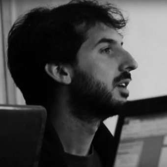
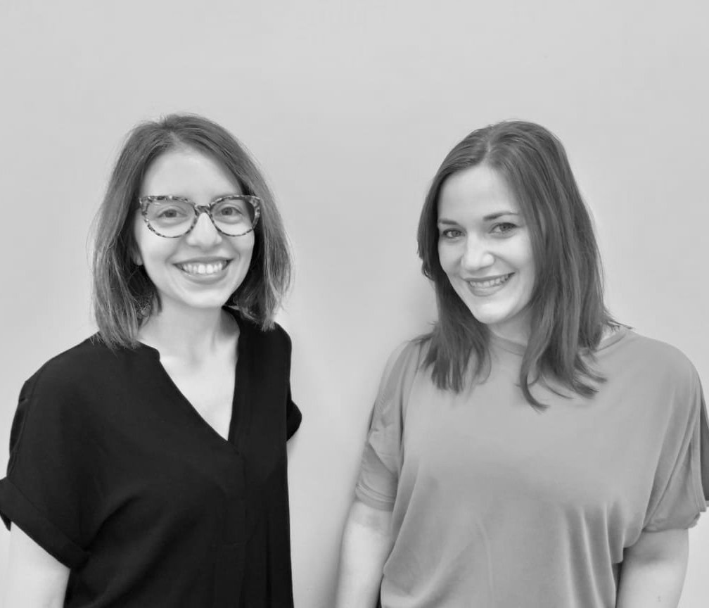
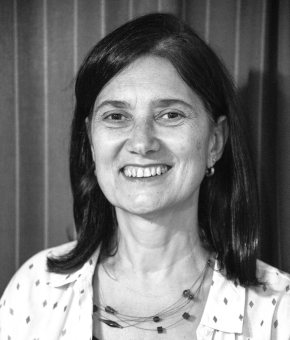
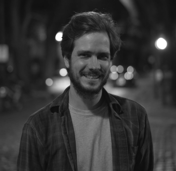
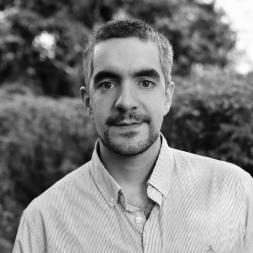
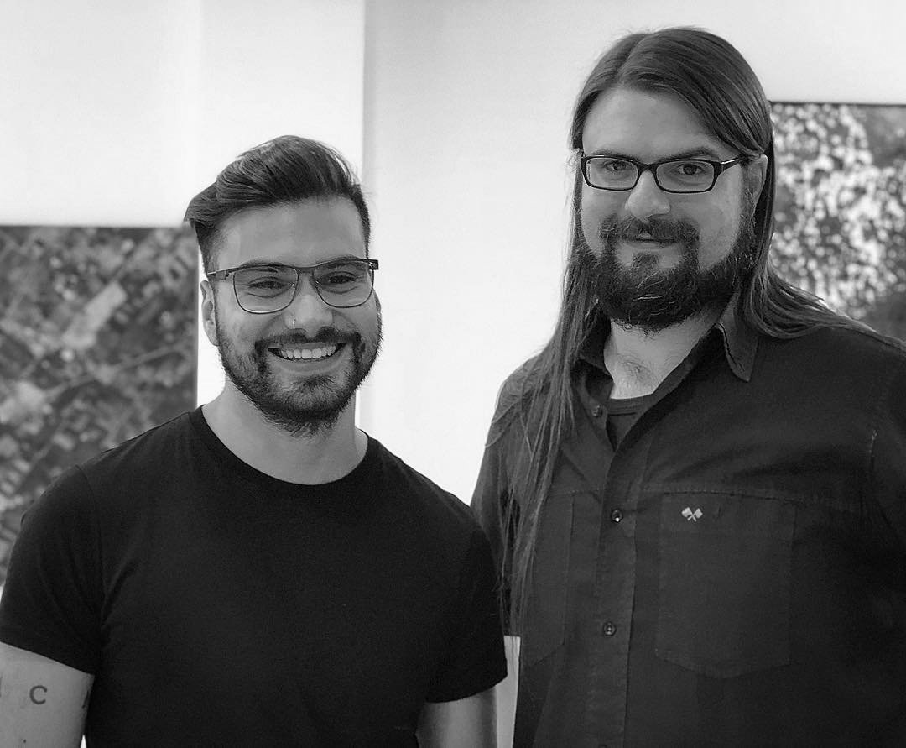

# Zruput

Zruput es una conferencia de Comunicaciones Digitales.

Su primera edición tendrá lugar el viernes 14 de Junio en [CCKonex](https://www.cckonex.org/), Buenos Aires, Argentina.

Las entradas están a la venta en [eventbrite](https://www.eventbrite.com.ar/e/zruput-tickets-57829836598).

## Propósito

Las nuevas exigencias sobre las telecomunicaciones que la sociedad ha alcanzado
y el desarrollo tecnológico que intenta satisfacerlas han dado nacimiento a
un ecosistema que se caracteriza por combinar los tradicionales rubros de
infraestructura de transmisión de señales con el diseño y producción de hardware de bajo costo,
la adopción de protocolos abiertos, las prácticas modernas de desarrollo de software
y el estudio de impacto social, entre muchas otras disciplinas.

Esta conferencia será un espacio inédito de exposición, discusión y articulación
para las personas que trabajan, investigan, emprenden, se forman y resuelven problemas en este nuevo ecosistema.

A modo orientativo, a continuación se lista algunos de los temas de interés, sin pretensión de ser exhaustiva:
* Estudio del crecimiento de la demanda de datos de internet.
* Aplicaciones de redes de sensores inteligentes.
* Nuevas posibilidades con hardware abierto de bajo costo (SDR, IoT, etc.)
* Protocolos de comunicación.
* Integración de las redes sociales con las nuevas tecnologías de conectividad.
* Redes mesh.
* Comunicaciones Satelitales.
* Diseño de antenas e infraestructura para uso compartido eficiente del espectro RF.
* Prácticas modernas y ágiles de desarrollo de software (VCS, CI, TDD, etc.) aplicadas a proyectos intensivos en hardware.
* Comunicaciones ópticas (fibras, láser, satélites, etc.)
* Posibilidades del uso amateur del espectro electromagnético.
* Arquitecturas de procesamiento digital (DSP, FPGA, etc.) y sistemas embebidos.
* Compatibilidad EM.
* Nuevas técnicas de procesamiento, modulación y codificación digital de señales (Cognitive radio, etc.)

## Exposiciones

### Santiago Piccinini, from Altermundi

He will talk about the challenges of closing the digital gap
with an open/libre hardware router.

### Santiago Tempone, from Skyloom

He will talk about how [Skyloom](www.skyloom.co) is developing
an Optical Communications satellite constellation for
very high throughput spaceborne networks.

### Francisco Albani, from Satellogic

He will talk about how to design a LEO satellite link for
high volume download of data.

### Sebastián García Marra, Co-Founder of LESS

IoT: State of the art, challenges and what nobody tells you about working with the Internet of Things.

### Mariela Fiorenzo, STEM specialist in Telecom Argentina

Evolución de los patrones de uso de internet y nuevas formas móviles de consumir TV.

### Federico La Rocca, Universidad de la República

TV digital libre: transmisión y recepción de ISDB-T con SDR.

### Andrea Reschini, from IEEE-WIE

* **Title:** Fibras que nos conectan.
* **Subtitle:** buceando la capa cero, en alta velocidad y a todo color.

* **Description:** las comunicaciones a través de Fibras Ópticas terrestres y submarinas, presentan grandes desafíos, dando lugar a innovaciones muy interesantes. La longitud de onda como dimensión en la multiplexación de señales es un aspecto activador de tecnologías para desarrollar "la capa cero" de servicios en constante evolución, y la determinación de modelos de negocio específicos.
    * El medio óptico. Propagación de la luz. Dimensiones en la multiplexación de señales
    * DWDM - Dense Wavelength Division Multiplexing: Nociones básicas y componentes
    * Algunos hits tecnológicos: Amplificación Raman, Detección Coherente, Topologías, otros
    * Lambdas en el mar: Generalidades de comunicaciones ópticas submarinas. El mapa de cables y players.

### Juan Cristi, INTI

Digital pre-distortion.

### Lucas Riobó, UBA Facultad de Ingeniería GLOmAe CONICET

* **Title:** Cuando el canal es más importante que el mensaje.
* **Subtitle:** Técnicas de comunicaciones para medición de materiales.
* **Description:** Low cost Optical Laser Interferometer based in SDR.

### Alan Vivares & Santiago Buczak, from Satellogic & RCA

* **Title:** Proyecto TASSAT
* **Subtitle:** experimento educativo de radioaficionados para la transmisión de señales de radio desde satélites.

* **Description:**

TASSAT (Text And Speech Satellite Experiment), es un proyecto que consiste en una plataforma de software abierto que fomenta el conocimiento y entusiasmo por la actividad espacial en la comunidad amateur alojado en un Satélite de órbita baja.
La función de la carga útil secundaria es producir experimentos en un satélite de órbita baja que permiten a los estudiantes y aficionados a desarrollar sus propios experimentos que se transmiten a Tierra a través de radio en la banda de VHF, en un hardware asequible, para poder luego probar ese código en el espacio.

## Format

30-minute long talks.

## Deadlines

* ~Call for presentations closes: May 1st, 2019~
* Speakers notified and program announced: May 15th, 2019

## Admission and Travel

* Speakers will receive free admission to BuzzConf and Zruput.
* We are striving to provide some form of travel grant to assist with the costs of attending. We’ll post details here once a budget is finalized.

## Code of Conduct

Please read and follow the [code of conduct](./CODE_OF_CONDUCT.md) of the conference.
