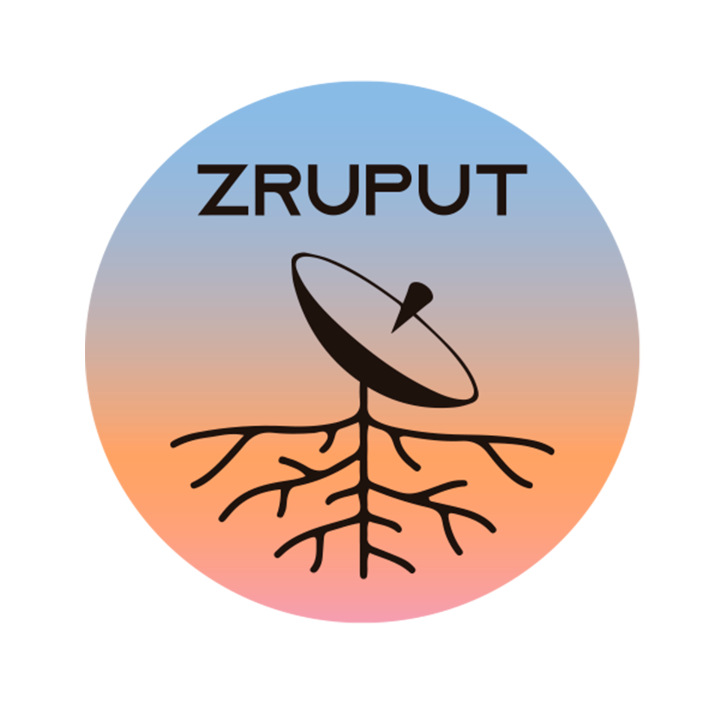
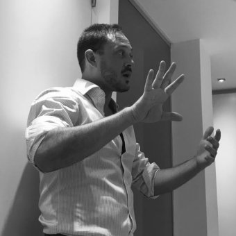
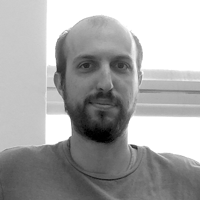

# Zruput

Zruput es una conferencia de Comunicaciones Digitales.

Su primera edición tendrá lugar el viernes 14 de Junio en [CCKonex](https://www.cckonex.org/), Buenos Aires, Argentina.

Las entradas están a la venta en [eventbrite](https://www.eventbrite.com.ar/e/zruput-tickets-57829836598).

## Propósito

Las nuevas exigencias sobre las telecomunicaciones que la sociedad ha alcanzado
y el desarrollo tecnológico que intenta satisfacerlas han dado nacimiento a
un ecosistema que se caracteriza por combinar los tradicionales rubros de
infraestructura de transmisión de señales con el diseño y producción de hardware de bajo costo,
la adopción de protocolos abiertos, las prácticas modernas de desarrollo de software
y el estudio de impacto social, entre muchas otras disciplinas.

Esta conferencia será un espacio inédito de exposición, discusión y articulación
para las personas que trabajan, investigan, emprenden, se forman y resuelven problemas en este nuevo ecosistema.

A modo orientativo, a continuación se lista algunos de los temas de interés, sin pretensión de ser exhaustiva:
* Estudio del crecimiento de la demanda de datos de internet.
* Aplicaciones de redes de sensores inteligentes.
* Nuevas posibilidades con hardware abierto de bajo costo (SDR, IoT, etc.)
* Protocolos de comunicación.
* Integración de las redes sociales con las nuevas tecnologías de conectividad.
* Redes mesh.
* Comunicaciones Satelitales.
* Diseño de antenas e infraestructura para uso compartido eficiente del espectro RF.
* Prácticas modernas y ágiles de desarrollo de software (VCS, CI, TDD, etc.) aplicadas a proyectos intensivos en hardware.
* Comunicaciones ópticas (fibras, láser, satélites, etc.)
* Posibilidades del uso amateur del espectro electromagnético.
* Arquitecturas de procesamiento digital (DSP, FPGA, etc.) y sistemas embebidos.
* Compatibilidad EM.
* Nuevas técnicas de procesamiento, modulación y codificación digital de señales (Cognitive radio, etc.)

## Exposiciones

### Santiago Piccinini, from Altermundi

He will talk about the challenges of closing the digital gap
with an open/libre hardware router.

### Santiago Tempone, from Skyloom

He will talk about how [Skyloom](www.skyloom.co) is developing
an Optical Communications satellite constellation for
very high throughput spaceborne networks.

### Francisco Albani, from Satellogic

He will talk about how to design a LEO satellite link for
high volume download of data.

## Sebastián García Marra, Co-Founder of LESS

IoT: State of the art, challenges and what nobody tells you about working with the Internet of Things.

## Federico La Rocca, Universidad de la República

**TV digital libre: transmisión y recepción de ISDB-T con SDR.**

Casi todos los países de Latinoamérica han adoptado el estándar ISDB-T para las transmisiones de Televisión Digital por aire. Aunque el "apagón analógico" no se ha llevado a cabo todavía y la transición de analógico a digital tiene diversos niveles de avance en la región, es un hecho que la televisión de aire sigue siendo uno de los principales medios de comunicación.

Una limitante importante en la transición se puede encontrar tanto en temas técnicos como de costos: no se logra ser experto en un tema si no se trabaja con implementaciones reales, y equipos específicos para televisión digital son altamente costosos. En este sentido, discutiremos cómo SDR (Radio Definida por Software) puede ser una excelente herramienta para atacar estos problemas.

La charla presentará gr-isdbt, un módulo para GNU Radio que permite recibir y transmitir televisión digital en el estándar ISDB-T, y que desarrolláramos en el Instituto de Ingeniería Eléctrica (Facultad de Ingeniería, UdelaR). El módulo permite por ejemplo realizar varias mediciones sobre la señal recibida (estimación del canal, BER, MER, etc.), o simular un sistema completo de transmisión y recepción (lo que permite por ejemplo optimizar los parámetros detransmisión para cierto canal). El sistema es además libre y abierto, lo que a su vez permite sustituir o modificar bloques, habilitando no solo el aprendizaje sino también el desarrollo y la investigación (ver https://github.com/git-artes/gr-isdbt). Esto además de, por supuesto, permitir ver la novela de la tarde o transmitir tus propios videos de gatos.

## Format

30 minutes long talks.

## Deadlines

* Call for presentations closes: April 1st, 2019
* Speakers notified and program announced: April 15th, 2019

## Admission and Travel

* Speakers will receive free admission to BuzzConf and Zruput.
* We are striving to provide some form of travel grant to assist with the costs of attending. We’ll post details here once a budget is finalized.

## Code of Conduct

Please read and follow the [code of conduct](./CODE_OF_CONDUCT.md) of the conference.
